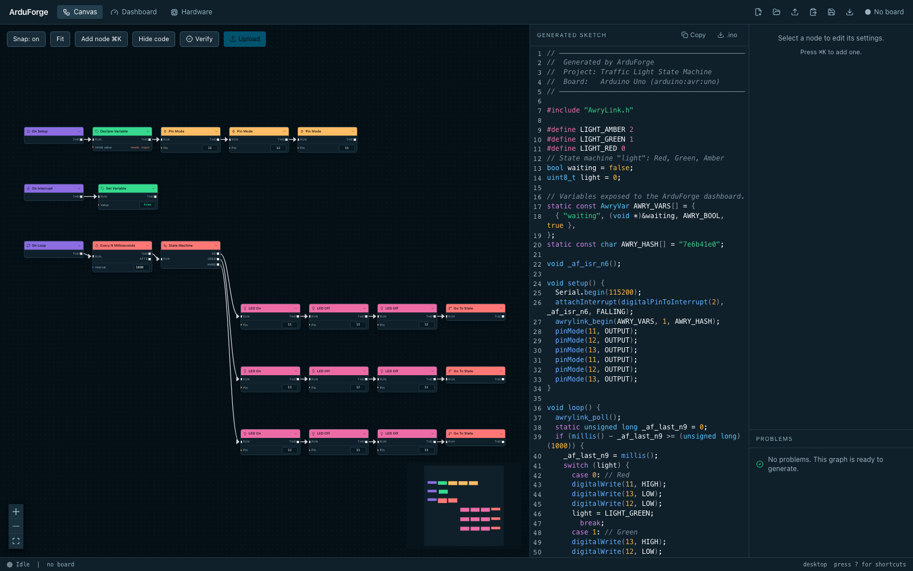
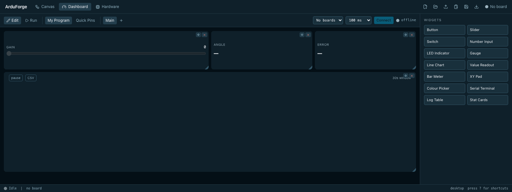
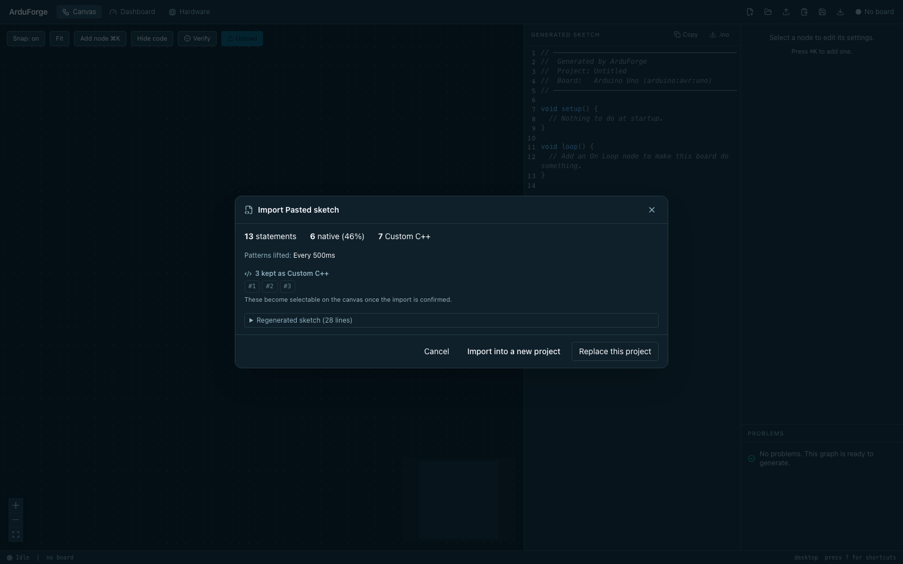

# ArduForge


A visual programming environment for Arduino. You build a node graph, it
generates Arduino C++, compiles and uploads it with `arduino-cli`, and a live
dashboard shows variables and pins on the running board. Everything runs
locally. There is no account and no cloud service. VIDEO: https://youtu.be/eeF19fWYNsY?si=kSku-DnQP7awkpwx

## What it does

The canvas is the editor. 149 nodes across 10 categories cover pins, timing,
control flow, maths, variables, serial, and components like servos, NeoPixels,
LCDs and DHT sensors. Wiring them produces a sketch. The generated C++ sits in a
panel next to the graph and updates as you work, and it is written to be read:
real variable names, ordinary control flow, comments preserved from imported
code. You can select it, paste it into the official Arduino IDE, and it
compiles. That is worth stating plainly because most graph-to-code tools produce
output nobody would want to open.

The dashboard is the other half. Tick "Expose to Dashboard" on a variable and it
is sent over the serial link while the sketch runs, at 115200 baud, so you can
watch a sensor value move or drive a servo from a slider without recompiling.
The link runs on a small firmware called AwryLink that travels with any sketch
exposing a variable. There is also a Quick Pins mode built on StandardFirmata
for poking at pins with no sketch of your own at all.

## Screenshots







## Requirements

- Node 22 or newer
- `arduino-cli` 1.x with the `arduino:avr` core
- An Arduino Uno. See the platform note below.
- Any current browser. Nothing here needs a specific one.

## Platform support

Be aware of what has actually been tested.

| Platform | State |
|---|---|
| macOS | Developed on it. Verified against real hardware, including upload and the live link. |
| Windows | Supported in code and covered by CI. Serial enumeration and upload are **unverified against a real board**. |
| Linux | Supported in code and covered by CI. Serial enumeration and upload are **unverified against a real board**. |

CI runs the full test suite on all three, so the code paths are exercised, but a
CI runner has no Arduino plugged into it. If you run ArduForge on Windows or
Linux with a board attached, an issue saying whether it worked is genuinely
useful, and a bug report is more useful still.

Board support is narrower than the platform support. Only `arduino:avr:uno` is
validated. The board table recognises the genuine Uno R3, CH340 clones, and the
DFRobot DFRduino, all as the same FQBN. Other AVR boards may work if you pick
the FQBN by hand, but nothing has been tested and the node library assumes an
Uno's pins and its 2KB of SRAM.

## Install and run

Clone the repository, then double-click the launcher for your platform:

| Platform | File |
|---|---|
| macOS | `start.command` |
| Windows | `start.bat` |
| Linux | `start.sh` |

It checks Node, checks `arduino-cli`, offers to install the AVR core if it is
missing, installs npm dependencies if needed, starts both processes, waits for
them to actually respond, and opens a browser. Ctrl-C stops everything and
releases the serial port. If a prerequisite is missing it says which one and how
to install it for your platform rather than failing with a stack trace.

The same thing from a terminal:

```bash
npm start
```

Or run the two processes yourself:

```bash
npm install
npm run dev          # app on :5173, backend on :5174
```

To work on it with no board attached, `npm run dev:server:mock` adds an emulated
board that prints a counter and echoes what you send it. It is a development
aid. Do not upload to it, and do not let it stand in for a real hardware
failure.

## Using it

Open the Examples menu and load one. Blink is the smallest, Traffic Light shows
control flow, and Data Dashboard exercises the live link. Mistakes in the graph
itself, a missing `pinMode`, a cycle, a name that shadows a global, appear in the
problems panel before you compile, and clicking one jumps to the node
responsible. Press Verify to compile, and anything the compiler rejects is
reported with the file, line and column it came from. Press Upload to flash the
board. Then open the Dashboard tab and connect, and any variable you marked as
exposed starts streaming.

Building from scratch works the same way. Drag nodes from the picker, connect
execution and data ports, and watch the code panel to see what you are actually
making.

## Importing an existing sketch

Paste a sketch, or open a `.ino`, and ArduForge parses it with tree-sitter and
turns it into a graph. Every statement round-trips: the graph regenerates source
that compiles to byte-identical machine code, which is checked against a corpus
of 44 sketches on every build.

Not all of it becomes visual, though. Around 42% of statements in real Arduino
example sketches land on native nodes. The rest land in Custom C++ nodes, which
hold the original text verbatim and compile exactly as they did before. So an
import is always correct and always compiles, but a sketch using constructs the
node library has no equivalent for will arrive as a mix of nodes and code
blocks. Comments survive, and each node remembers which lines of the original it
came from.

## Limitations

- **Uno only.** One validated FQBN. Other boards are untested.
- **Windows and Linux are unverified against hardware.** See above.
- **Import lifts Servo, and nothing else.** A servo spread across a global
  declaration, an `attach` in `setup`, and `write` calls in `loop` becomes one
  node. LCD, NeoPixel and DHT usage imports as Custom C++ instead. Those
  components have full nodes for building from scratch; it is only the import
  direction that does not recognise them.
- **11 bundled examples.**
- **`String` variables cannot be sent to the dashboard.** They are excluded
  deliberately: a fixed-size telemetry buffer is what keeps a 2KB heap from
  fragmenting, and strings do not fit that model.
- **A sketch that exposes variables needs `AwryLink.h` and `AwryLink.cpp`
  beside it.** ArduForge emits them with the sketch. If you paste only the
  `.ino` into the Arduino IDE, it will not compile until you add them too.
  Sketches with no exposed variables have no such dependency.

## Contributing

See [CONTRIBUTING.md](CONTRIBUTING.md). `npm run check` is the whole gate:
typecheck, lint, a colour contrast check, 800 tests, and seven importer gates,
one of which drives a real Chromium against a production build and one of which
compiles the corpus and compares machine code. It runs in about two minutes and
is the same command CI runs.

Bug reports are as welcome as patches, particularly from Windows and Linux.

## Documentation

| Doc | Contents |
|---|---|
| [docs/node-reference.md](docs/node-reference.md) | Every node, generated from the registry |
| [docs/troubleshooting.md](docs/troubleshooting.md) | Boards that will not appear, ports that will not open, uploads that time out |
| [docs/awrylink-protocol.md](docs/awrylink-protocol.md) | The dashboard wire format |
| [docs/THEMING.md](docs/THEMING.md) | How colour works, and why `tokens.css` is generated |
| [docs/IMPORT.md](docs/IMPORT.md) | What the importer measured and decided |
| [docs/NODE-REGISTRY.md](docs/NODE-REGISTRY.md) | Node contract changes, and which defaults are load-bearing |

## Licence

MIT. See [LICENSE](LICENSE), and [NOTICE](NOTICE) for third-party terms.

## Acknowledgements

[arduino-cli](https://github.com/arduino/arduino-cli) does all the compiling and
uploading. [tree-sitter](https://tree-sitter.github.io/tree-sitter) and its C++
grammar parse imported sketches. The import corpus is built partly from the
[Arduino example sketches](https://github.com/arduino/arduino-examples), which
are released into the public domain. The canvas is
[React Flow](https://reactflow.dev), the layout is
[elkjs](https://github.com/kieler/elkjs), the code panel is
[CodeMirror](https://codemirror.net), and the charts are
[uPlot](https://github.com/leeoniya/uPlot).
